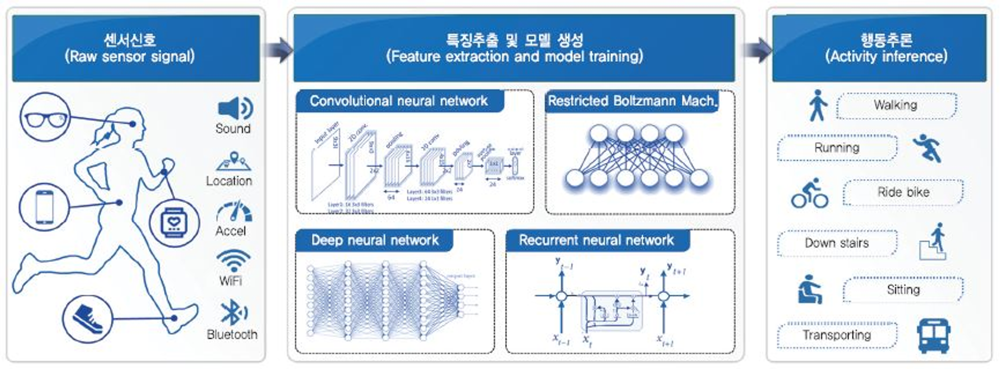
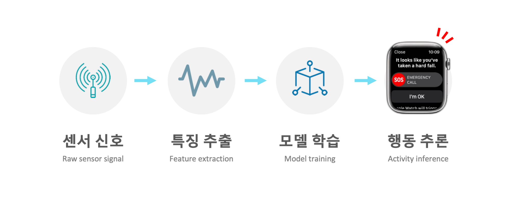
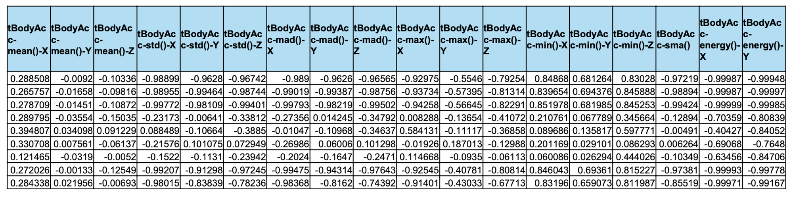
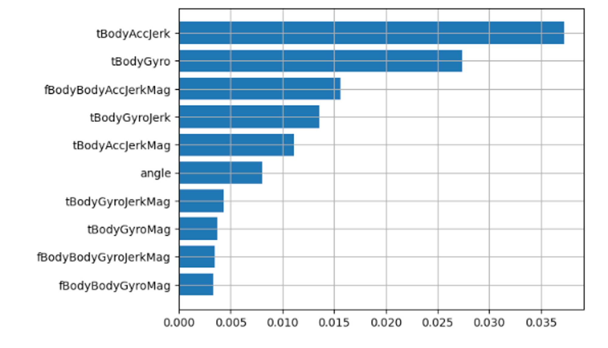
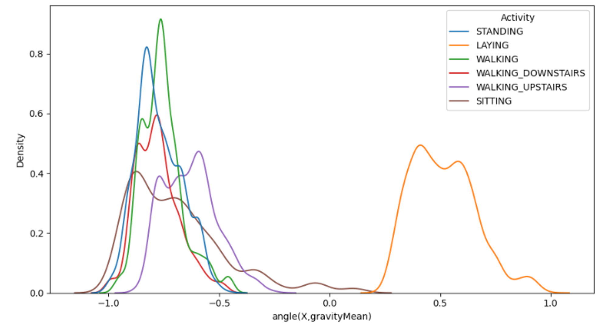
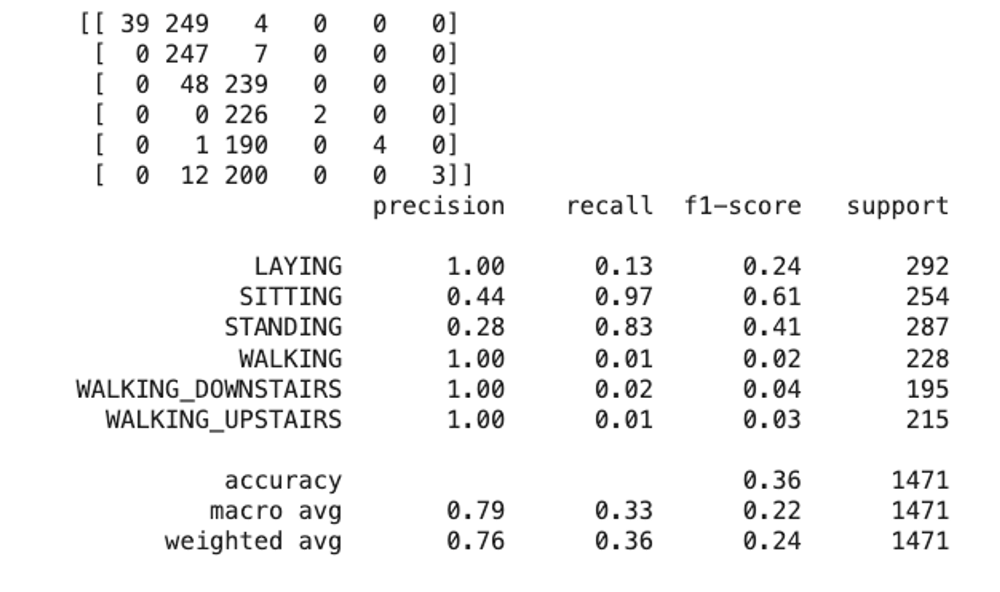
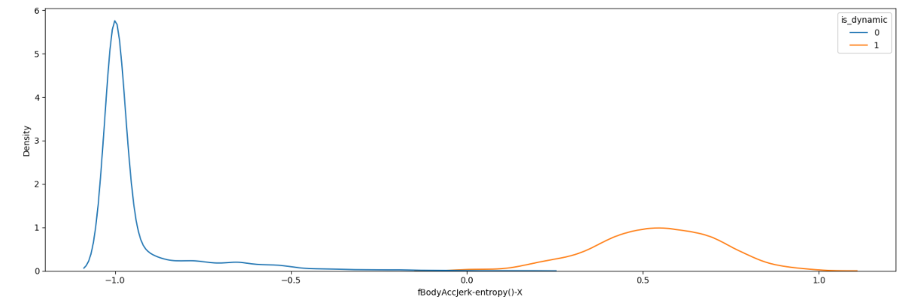
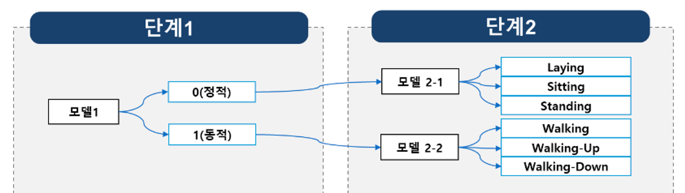
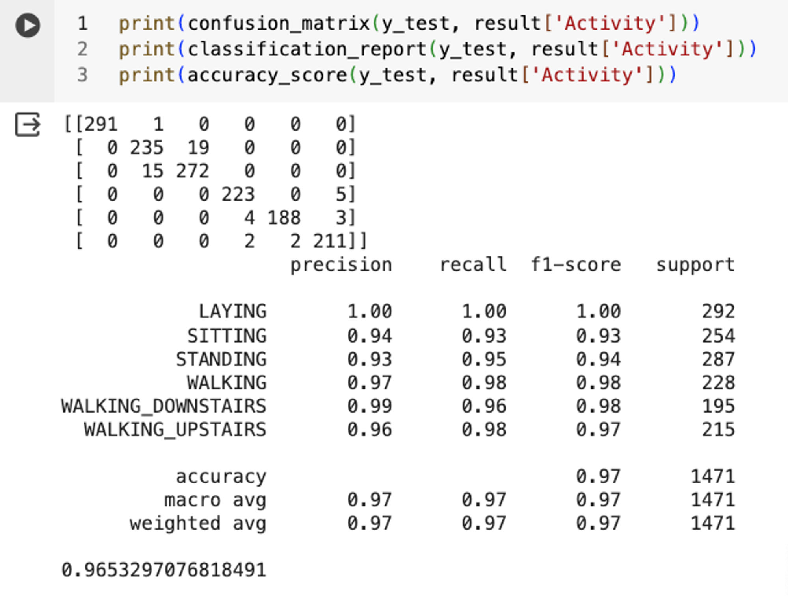

# 1차 미니프로젝트

        
    

# 주제
> 위급 상황 판단을 위해, 센서 데이터 기반 사람 행동 인식 모델 개발

 

## 개발 배경
- 최근 우리나라는 고령화로 인해, 노인 인구 증가 및 치매 환자가 증가하고 있다.

- 고령 환자 및 치매 환자에게 낙상 사고는 매우 치명적인 사고이며, 실제 국내 60세 이상 인구는 낙상 사고에 빈번히 노출되고 있다.

- 이에 스마트폰 기반의 센서 데이터를 활용해 사람의 동작을 분류하는 모델을 개발하고자 한다.

    

        
    

## 기대 효과
- 고객 : 노인 및 치매 환자에게 발생할 수 있는 사고를 줄일 수 있는 사전 안전 장치를 추가할 수 있다. 
- 정부 : 노인 및 치매 환자에게서 가장 빈번히 발생하는 낙상 사고를 빠르게 대처할 수 있다.

 

## 프로젝트 역량 목표

1.  **시계열 데이터 이해 및 데이터 구조** 파악
    > 🧑‍💻 Shift() 함수를 이용해 시계열 데이터 전처리

 

2. **데이터 분석(단변량, 이변량)**
    > 🧑‍💻 데이터 분석을 통해 562가지의 센서 데이터 값 중 중요한 센서 값 추려내기

    - 562가지의 모든 Feature 데이터를 이용하여 모델을 학습한다면 Overfitting 문제가 발생한다.

 

3. **단계별 모델링을 통해 낮은 정확도 극복해보기**
    > 🧑‍💻 센서 데이터 만으로는 유사한 행동을 분류하는데 한계가 존재한다.

    - 단계를 나눠 모델링하여 정확도 올려보기

 

## 데이터셋 
- 가속도 센서 데이터셋 (선형 가속도)
        
- 자이로스코프 센서 데이터셋 (각속도)

    

        
    

## 과제 결론

- 가속도 센서와 자이로스코프 센서가 추출하는 562가지의 모든 센서 값을 이용하여 모델을 학습한다면 Overfitting 문제가 발생할 수 있다. 이에 사람 행동을 분류하는데 가장 영향력이 높은 센서의 값을 Decision Tree를 이용하여 추출하였고, 지니 불순도가 가장 많이 줄어드는 Feature를 기준으로 하였다.

    

        
    

    
- 센서 데이터와 6가지 행동에 관계를 시각화 해본 결과, Laying을 제외한 나머지 5가지 행동들이 매우 유사한 센서 분포를 갖고 있었고 이는 센서값을 그대로 이용하여 6가지의 행동을 분류할 경우, 매우 낮은 정확도를 나타낸다는 사실을 의미 했다. 
    
    

        
    

- 실제 센서 값을 이용해 6가지 행동을 분류하는 모델을 학습한 결과 매우 낮은 Test 정확도를 갖고 있었고, 이는 다른 방법을 필요로 했다.
    
    

        
    

    

- 다양한 방법을 생각하던 중 정적 행동과 동적 행동이라는 좀 더 추상적인 행동을 분류해보고 분류된 모델에서 좀 더 구체적인 행동을 분류한다면 좀 더 좋은 정확도가 나오지 않을까 생각했다. 이에 정적 행동과 동적 행동의 센서 값을 분석해본 결과 실제 두 데이터는 전혀 다른 센서 분포를 가지고 있었고 좀 더 나은 모델을 만들 수 있겠다는 확신을 갖을 수 있었다.
    
    

        
    

- 이에 모델에 동적, 정적 행동을 먼저 식별하는 거대한 모델을 통과하고, 분류된 각 결과에 구체적인 행동을 분류하는 모델을 한번 더 통과시키는 방법을 이용해 6가지의 행동을 분류하는 모델을 학습하였다.
    

        
    

- 실제 매우 높은 정확도를 도출할 수 있었고, 수업시간에 배운 단계별 모델링에 활용 사례를 볼 수 있었다.
    

        
    

### Notion 링크
> https://www.notion.so/2-6ea730bbb82745e6b5f7ebf89de9df13?pvs=4