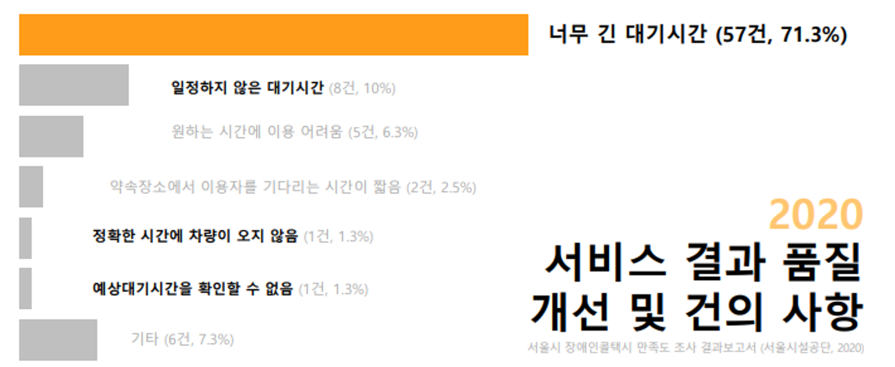
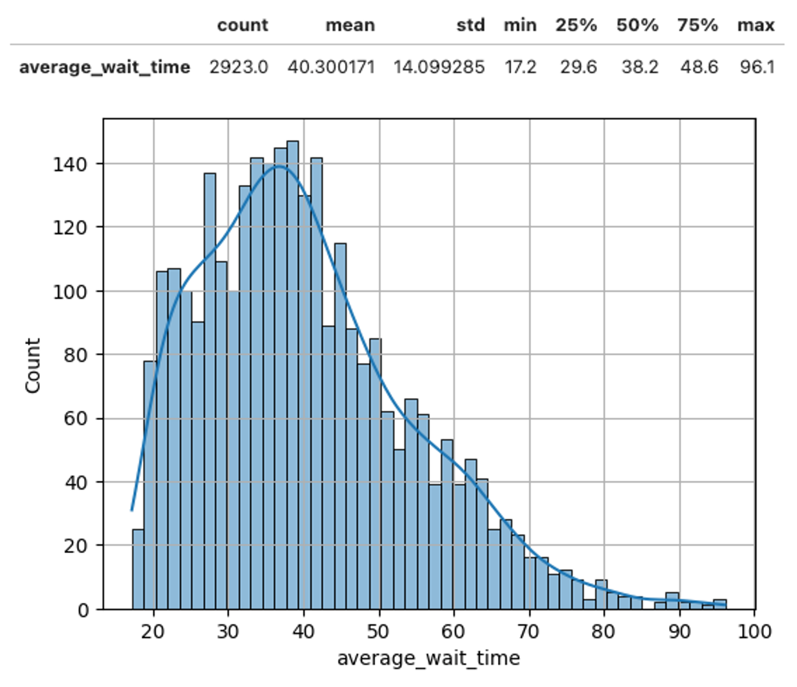
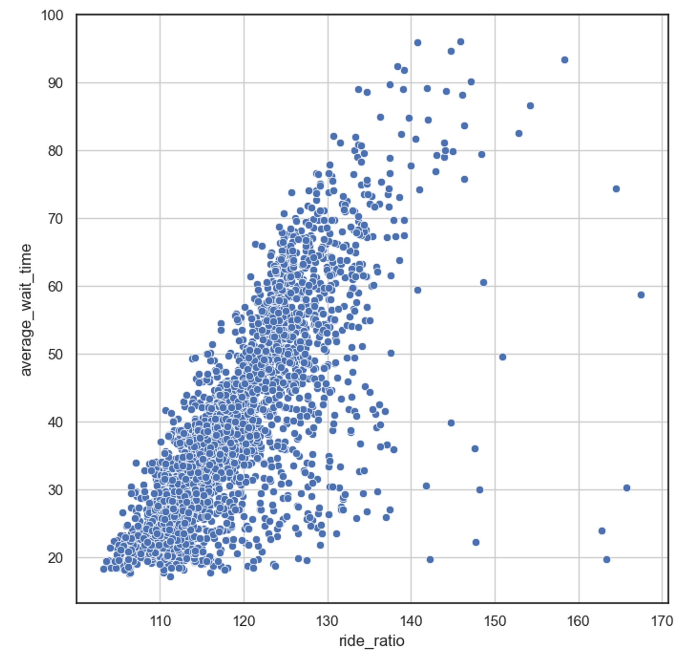
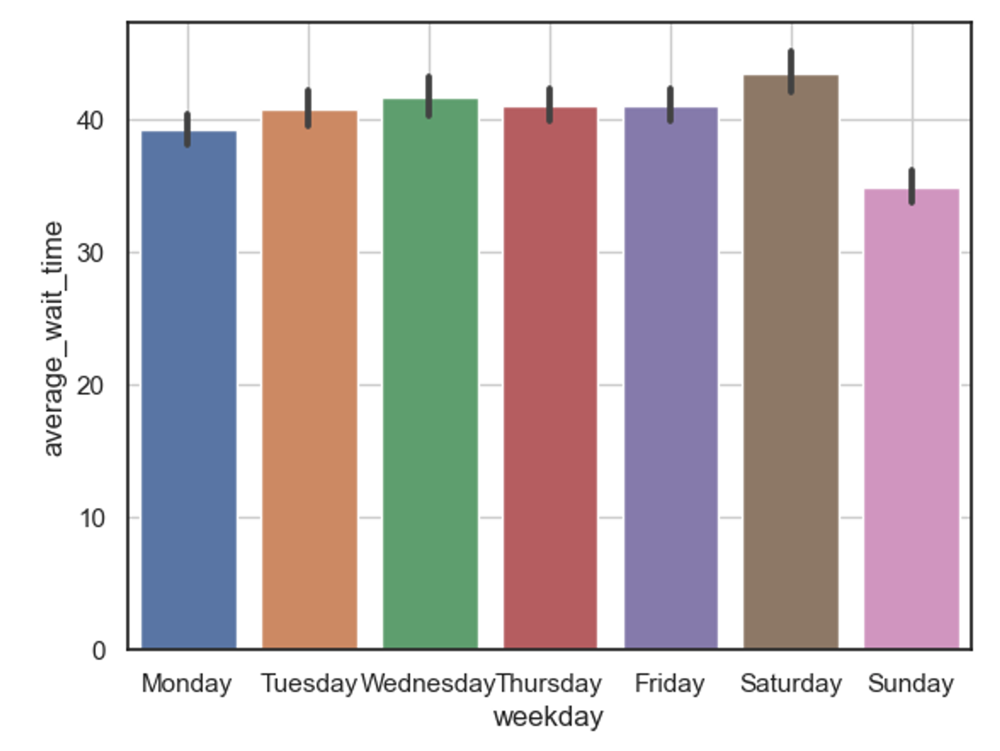
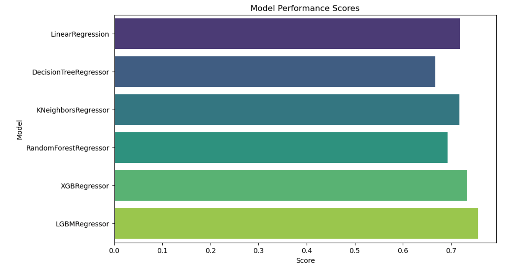

# 2차 미니프로젝트

# 주제
> 장애인 이동권 개선을 위한 장애인 콜택시 대기시간 예측 머신러닝 모델 개발

 

## 개발 배경
- 교통약자 이동권을 개선하기 위해 도입된 장애인 콜택시 사업의 불규칙한 차량 대기시간으로 인해 이용자와 제공자 모두가 어려움을 겪고 있다.

- 이에, 과거 2015년 ~ 2022년 장애인 콜택시 운행 정보와 날씨 정보 등을 활용하여, 차량 호출 전 차량 대기 시간을 예측하는 모델을 개발하고자 한다.

    

        
    

  

## 기대 효과
- 고객 : 차량 호출 전, 차량 대기시간을 미리 확인할 수 있다.  
- 정부 : 차량 대기시간이 길 것으로 추측되는 날, 운행 차량을 늘릴 수 있다.

  
## 과제 결론

- 콜택시 호출 후 평균적으로 40분 택시를 기다려야 하며, 짧게는 20분에서 길게는 90분까지도 택시를 기다려야 한다. 최대 70분 정도 차이가 나는 차량 대기 시간을 미리 알 수 없다면, 아무도 서비스를 이용하지 않을 것이다.
    
    

        
    

    
- 과제의 핵심은 차량 대기 시간에 영향을 많이 주는 외부 요인을 찾는 것이었다. 다양한 데이터와 차량 대기시간과의 상관 관계를 분석하였고, 차량 탑승률이 차량 대기시간과 가장 높은 상관 계수를 갖고 있었다.  많은 사람이 차량을 이용하고 있다면, 차량이 부족하고 이는 자연스럽게 대기 시간 증가에 영향을 끼쳤을 것이다. 차량 이용률이 높은 시간을 분석할 필요가 있다.
    
    

        
    

- 추가로, 출퇴근이 적은 일요일을 제외한 모든 날 운행 차량수와 관계 없이 평균 대기 시간이 높은 것을 확인하였다. 이는 서울 시 회사가 많고 회사 출퇴근이로 인한 차량 트래픽이 막혔을 것이라고 예상했으며, 실제 차량 트래픽 데이터를 분석해본 결과 서울 시 차량 운행 수와도 대기 시간이 높은 상관 계수를 갖고 있는 것을 확인하였다.
    
    

        
    

    

- 이외에도, 강수 여부, 코로나 환진자 수, 공휴일 등 차량 대기시간에 영향을 끼치는 다양한 요소들을 분석하였고 가장 영향을 많이 끼치는 7가지 요소를 선정하여 모델을 학습하였다. 다양한 모델중 LGBM Regressor 모델이 가장 높은 정확도로 차량 대기 시간을 분석하였다.
    
    

        
    

  

## Regression 모델
- Linear Regression
- KNN Regressor
- Decision Tree Regressor
- Random Forest Regressor
- XGBR Regressor
- LGMB Regressor

  

### Notion 링크
> https://www.notion.so/6c4e0f3adf464aaaac25053425561a2e?pvs=4

